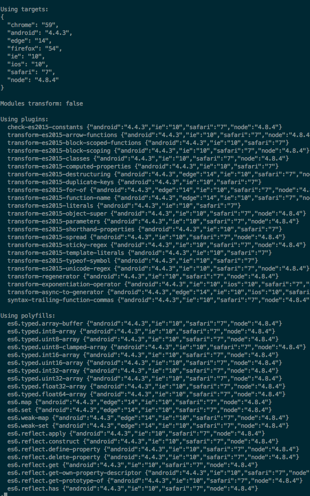
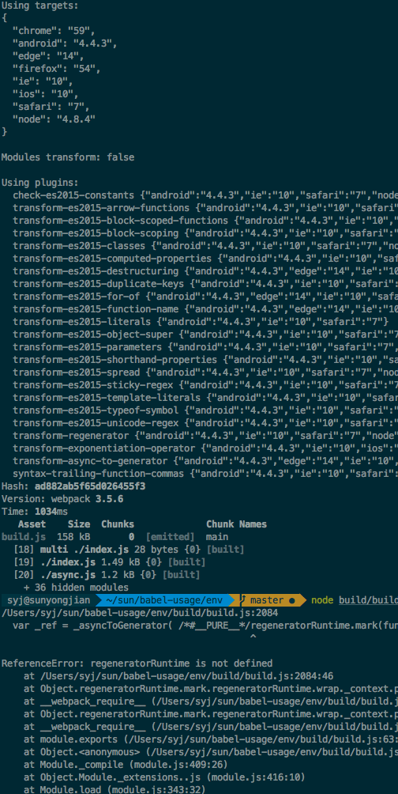
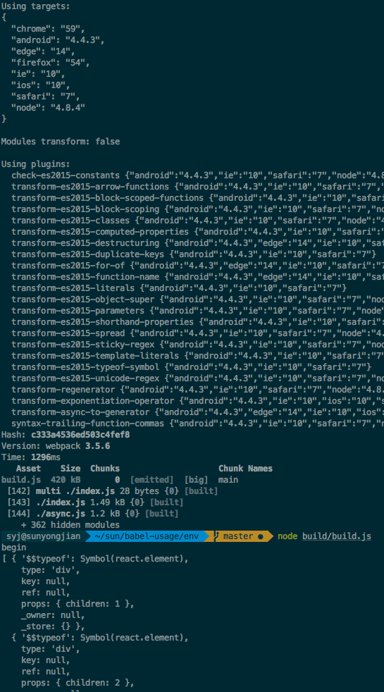
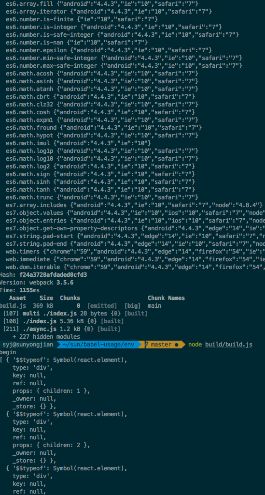
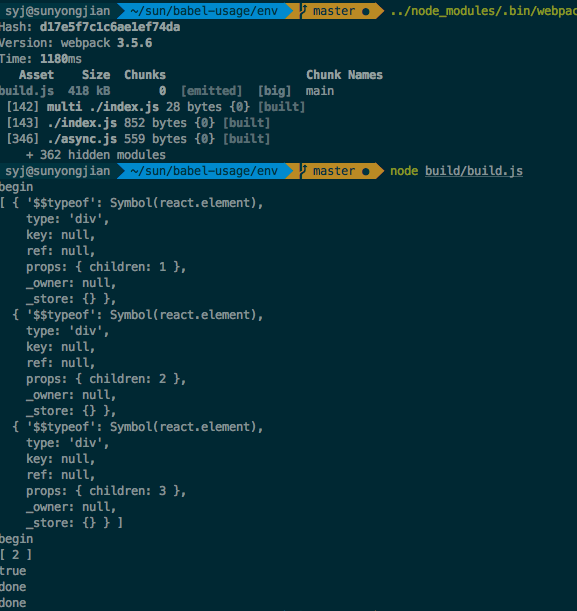
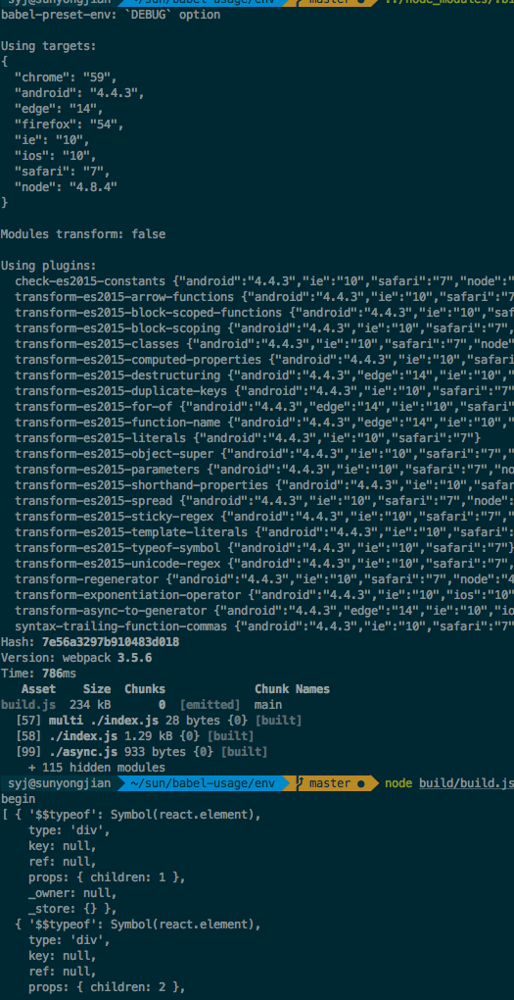

## 介绍
通过配置 env 的 options，并查看编译的结果

### 默认值
babel-preset-env 的默认情况下，作用跟 preset-lastest 是一样的，即包括 preset-es2015,16,17.
```javascript
{ "presets": ["latest"] } === { "presets": ["env"] }
```


执行 
```
node_modules/.bin/babel env/index.js
```

### debug

开启 debug 模式之后的 log



### 对比查看 useBuiltIns 的效果

列出了需要的 polyfill，确实也只引用了那些。

- 使用 env，不加 useBuiltIns，不```require('babel-polyfill'```

  

  build.js 代码体积 158k，node build.js 执行报错。

- 使用 env，加 useBuiltIns，不```require('babel-polyfill'```

  跟上面的结果一样。

- 使用 env，不加 useBuiltIns，```require('babel-polyfill'```
 
 

  因为引入了 polyfill，build.js 代码体积瞬间 420k，执行通过。

- 使用 env，加```useBuiltIns: true```，```require('babel-polyfill'```

  

   build.js 体积 369k，执行通过。包确实减小了。

- 用 es2015，并引入 polyfill
 
 
  plugins 多加一个 transform-regenerator，这方面确实不如 env 方便一些。
  体积 418k，执行通过。不方便在要配好多 plugins。

- env 下，不加 useBuiltIns，不引入 babel-polyfill，使用 transform-runtime。


  


### helpers
使用 webpack 查看 index.js 和 async.js 都用到了 async 函数，_asyncToGenerator 函数是否会多次定义，答案是肯定的，因为没有 runtime，也没有生成 helpers.js 所以他会在各个模块中自己生成。所以这里我们可以自己利用 babel-external-helpers 去生成。[参照](https://github.com/sunyongjian/babel-usage/tree/master/helpers)


### 最后
个人觉得 env 适合你了解项目要支持的执行环境，设置好 targets 后，根据映射关系，提供当前所需要的 plugins 和 polyfill。