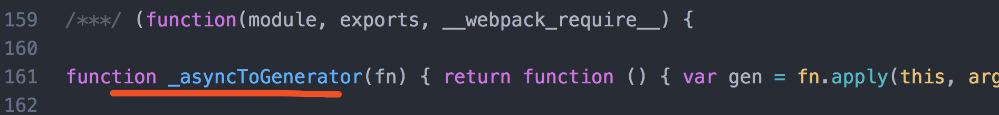
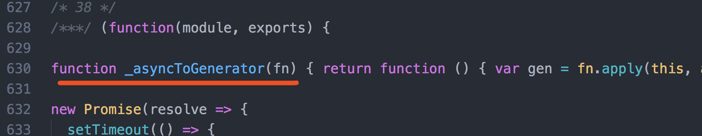
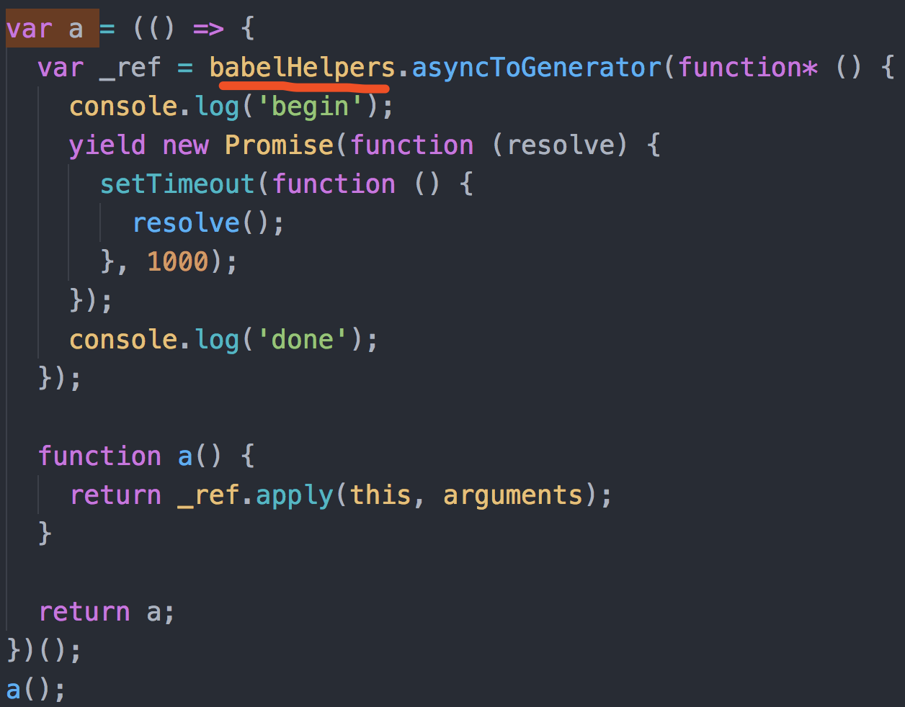
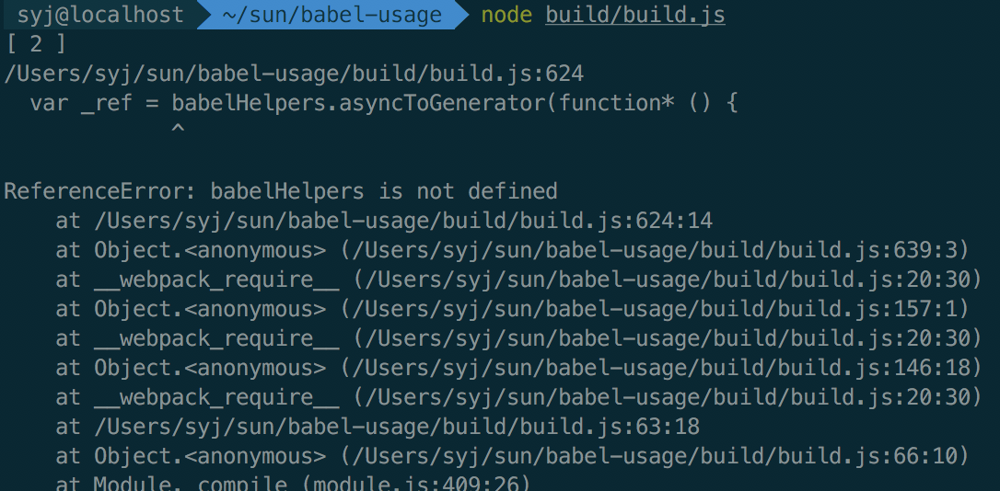

## 测试 external-helpers
### 介绍用例
1. 通过 webpack 打包，入口为 index.js。利用 async 函数在 node 4.8.4 中不兼容，需要通过 babel 编译。
transform 的过程中用到了 babel 的 helper 函数，所以我在 test1.js 和 test2.js 中都使用了 async，然后用 webpack 打包完后，查看 build 文件中，测试这两个模块是不是都定义了 helper 函数。
2. 如果的确是官方说的那样，每个文件都引入 helper。利用给的 plugin external-helpers 去解决这种问题。

3. 方式：webpack 打包，输出到 build/build.js。然后查看并运行 build.js 测试。

### 过程
1. 首先引入 plugin transform-async-to-generator，顾名思义是把 async 函数翻译成 generator。
执行
```
node_modules/.bin/webpack

node build/build.js
```
编译通过，执行通过。

2. 查看 build.js 





的确两个模块中都有 asyncToGenerator 这个函数。

3. 加入 babel-plugin-external-helpers
```
node_modules/.bin/webpack
```
编译通过，build.js 里面的 helper 函数有所更改。变成了 babelHelpers.asyncToGenerator 了，看起来是成功了，没有重复声明，都到 babelHelpers 对象里了。



执行
```
node build/build.js
```

报错了。



babelHelpers is not defined

4. 那就去定义 babelHelpers

通过 执行 babel-external-helpers， 生成 helpers 文件。
```
node_modules/.bin/babel-external-helpers > helpers.js
```
得到 helpers 文件，并在入口文件引入。

5. 重新编译，执行。通过


### preset-env
另外，这些语法转换的 plugins，都可以用 babel-preset-env 去代替。然后再配一下 external-helpers 就可以啦。操作是一样的。