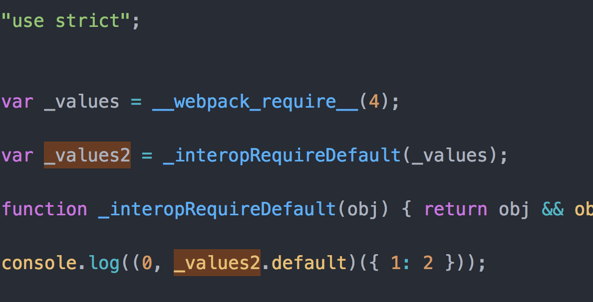
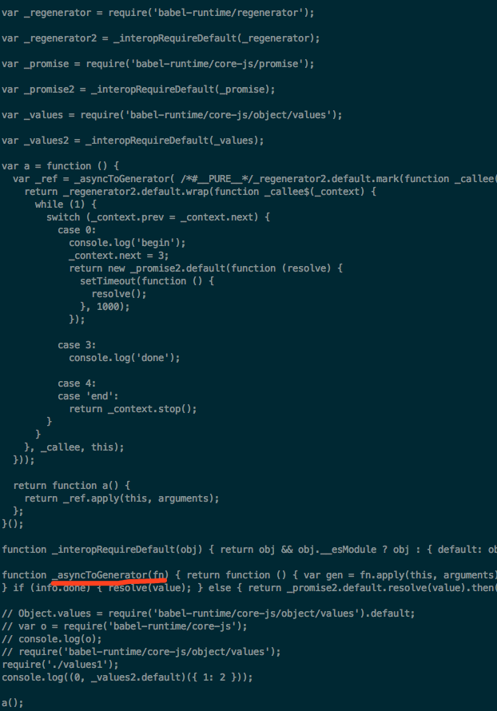

## 测试 transform-runtime
babel-runtime 和 babel-plugin-transform-runtime 一起使用。

### 介绍用例
1. 通过 webpack 打包，查看 build.js 中 ```Object.values()``` 是否被替换，是否从 babel-runtime 中引入。
2. 通过 babel-cli 编译，查看 async+values.js 中的 async函数 和 Object.values 的编译情况。主要是为了测试 babel-plugin-transform-runtime 的参数问题，Object.values 用到了 core-js. async 用到了 helpers 和 regenerator。通过改动 options，查看最后的编译结果。

### 过程
1. webpack 结果

执行,使用 runtime 下的 .babelrc 和 wepback.config.js
```
cd runtime && ../node_modules/.bin/webpack
```



2. 切换 helpers 参数

```
cd runtime && ../nodu_modules/.bin/babel async+values.js
```

有 helper 参数


没有 helpers
